### Escuela Colombiana de Ingeniería

### Arquitecturas Empresariales

#### TALLER 1: DISEÑO Y ESTRUCTURACIÓN DE APLICACIONES DISTRIBUIDAS EN INTERNET

#### Santiago Arévalo Rojas

### Instrucciones para ejecución

Para ejecutar la aplicación se deben seguir los siguientes pasos:
1. Se debe clonar el repositorio de github con el enlace dado en la entrega, el cual es: [https://github.com/santiarojas18/Lab2AREP.git](https://github.com/santiarojas18/Lab2AREP.git)
2. Una vez clonado se debe abrir el proyecto en el IDE de preferencia, en este caso se abrió en IntelliJ:  
    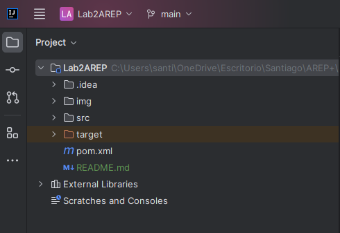
3. Luego en el directorio src vamos a la clase HttpServer que es la clase web server, en la cual se tiene la función main:  
    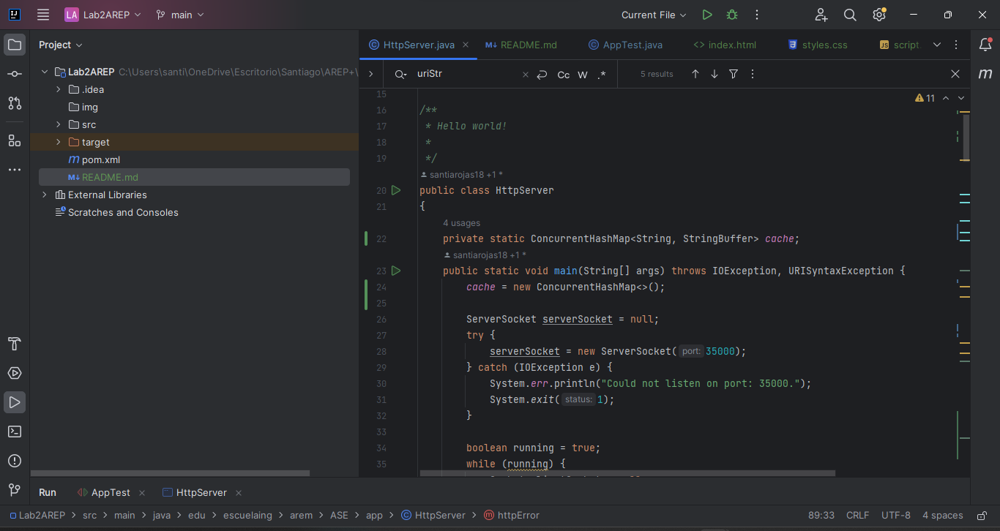
4. Al ejecutar la aplicación desde el IDE evidenciamos que el servidor efectivamente está prendido y esperando por peticiones:  
    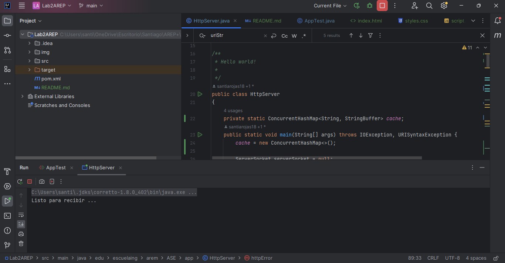
5. Para ver el correcto funcionamiento nos dirigimos a un navegador, en este caso a google y nos conectamos por medio de la URL de localhost que está escuchando por el puerto 35000, lo primero que vamos a probar será el api fachada de películas, para esto se obtiene por medio del recurso /movies/nombredepelicula, en este caso si queremos buscar de la pelicula "bee movie" se realiza de la siguiente manera: [http://localhost:35000/movies/bee movie](http://localhost:35000/movies/bee%20movie): 
    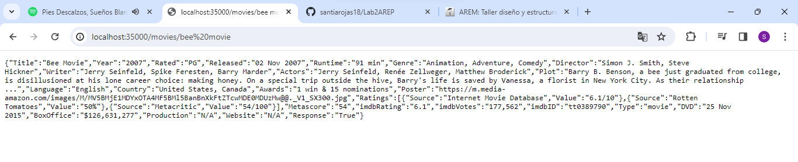
6. Ahora queremos observar que el servidor sabe interpretar imagenes, así que para obtener un archivo simplemente se pone el nombre directamente despúes en el path, en este caso para ver la imagen "prueba.png", lo hacemos: [http://localhost:35000/prueba.png](http://localhost:35000/prueba.png):  
    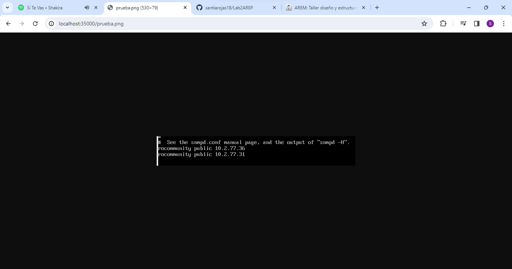
7. De la misma manera, si se hace una petición a un archivo no existente, el servidor sabrá responder de manera correcta, dando el siguiente mensaje a la petición: [http://localhost:35000/hola.txt](http://localhost:35000/hola.txt):  
      
    Si se desea probar con cualquier nombre de archivo no existente, estos son los archivos públicos a los que se tiene acceso:  
    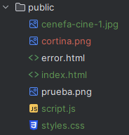
8. Finalmente para verificar un funcionamiento completo, haremos la petición de una página web básica HTML-JS-CSS, llamada index.html, que utiliza los archivos script.js y styles.css, cuya URL es: [http://localhost:35000/index.html](http://localhost:35000/index.html):  
    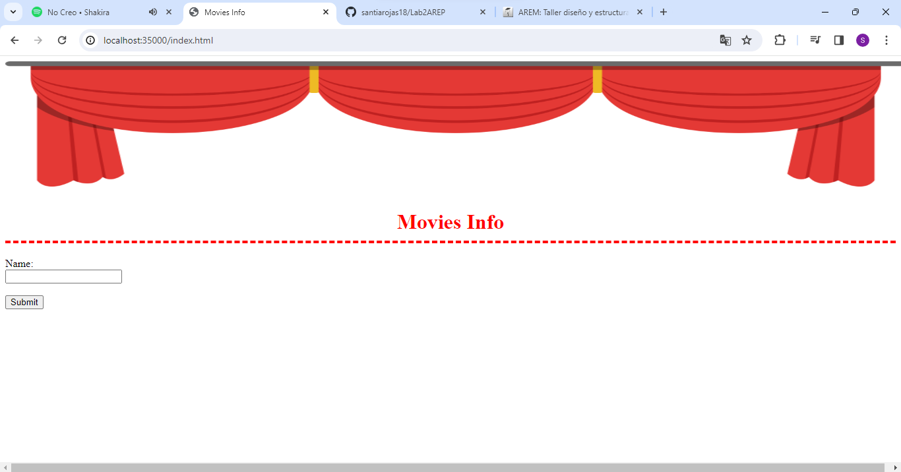
    Esta página web hace uso del api fachada de este mismo servidor, para realizar la consulta basta con escribir el nombre de la pelicula y darle click al botón de submit:  
    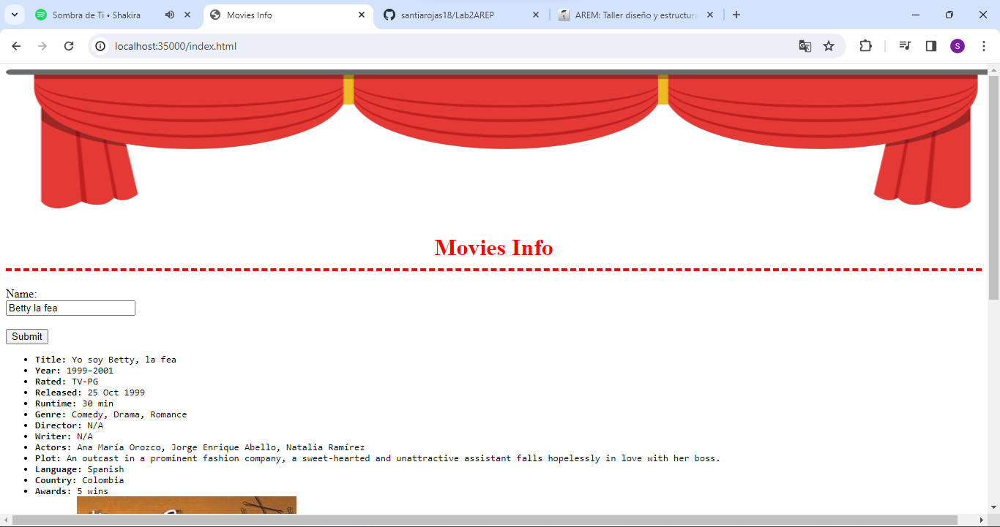  
   Evidenciamos que el servidor carga de manera correcta las imagenes (cortinas de teatro), archivo js para el cliente asíncrono y archivo css para los estilos (Color de las letras, centrado y borde):  
    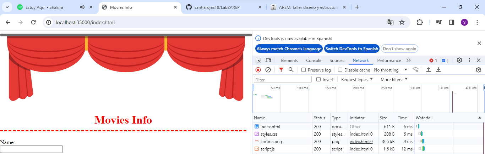  
    Del mismo modo cuando se hace la solicitud al API:  
    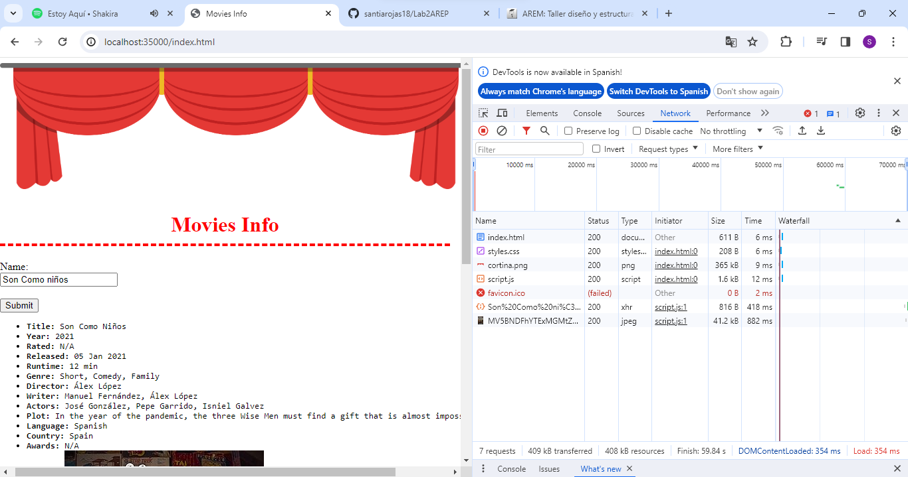

### Información del diseño

* Para realizar la tarea de manera sencilla se modularizó la consulta de archivos en 4 métodos, de estos 4 solo dos son llamados directamente por la función main y son invocados si se está haciendo la solicitud al api(corresponde al primer condicional) o si se está solicitando un archivo(segundo condicional):  
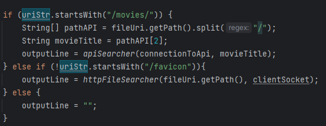  
* En caso de hacer una petición al API, se llama al método apiSearcher, en donde se continuó con las mismas decisiones de diseño del primer laboratorio donde se tenía una clase aparte para realizar la conexión al API externa y la clase HttpServer simplemente tenía un objeto de esta clase para realizar la solicitud, por otra parte, para seguir mejores prácticas de APIs, se modificó el nombre por /movies y para obtener la información de una película se hace de la manera indicada en el aprtado "Instrucciones para ejecución", manteniendo el caché para tener eficiencia.
* De lo contrario, si se está pidiendo un archivo, se invoca al método httpFileSearcher, dentro de este el mismo se encarga de ver si el archivo solicitado es una imagen o no, de serlo, entonces llama al método imagesReader, debido a que al ser una imagen, tiene que ser leído de manera directa sus bytes.
* Para conocer el tipo de contenido que se retorna en la respuesta HTTP y dar un encabezado correcto, se hizo uso de la clase Files y el método probeContentType:  
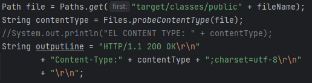
* Para manejar errores de tipo not found, donde el usuario solicita un archivo no existente lo hace el mismo método httpFileSearcher, en donde si le salta una excepción de IO, llama al método httpError que retorna como respuesta un HTML indicando 404-Not found y con código de respuesta HTTP 404:  
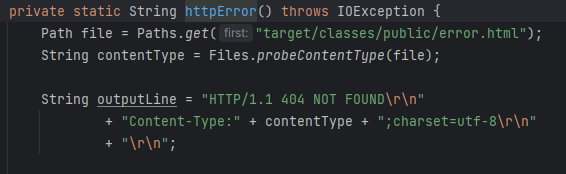

### Pruebas y Evaluación

Para validar el funcionamiento se realizaron de nuevo peticiones a la API y externa y además peticiones de archivos al servidor para confirmar que se estuvieran respondiendo de manera adecuada. Para su ejecución basta con dirigirse a src/test/ y ejecutar la clase AppTest.